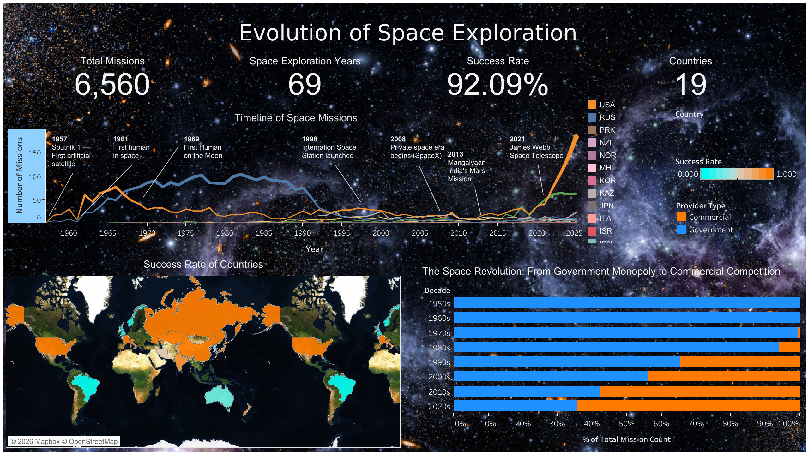
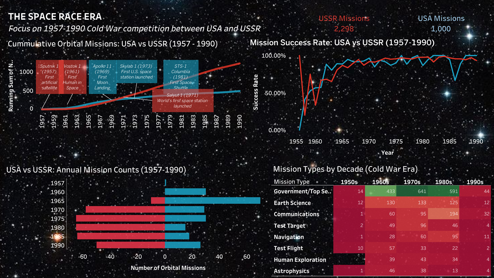
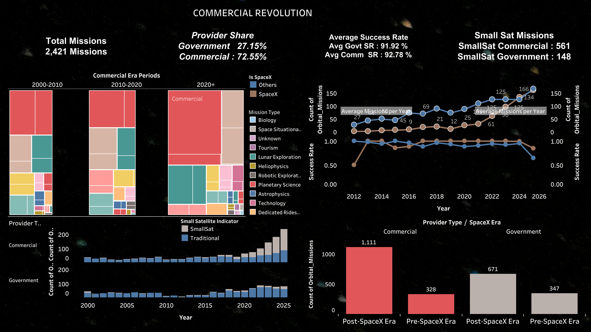
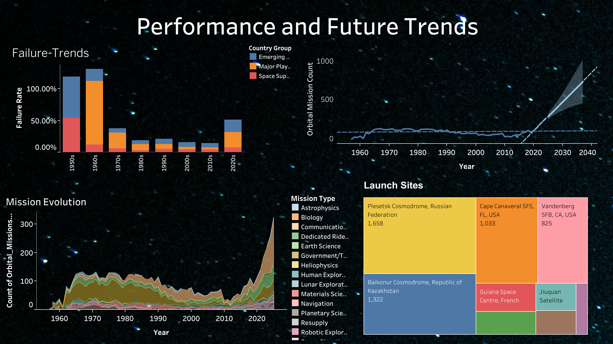

# 🚀 Evolution of Space Exploration: Orbital Missions Analysis (1957–2025)

An end-to-end **data visualization and analytical project** exploring the evolution of global orbital space missions from **1957 to 2025**.  
This project uses **interactive Tableau dashboards** to uncover historical trends, geopolitical shifts, mission performance, and the rise of commercial space exploration.

---

## 📌 Project Overview

Space exploration has transformed from a **government-dominated Cold War race** into a **commercially competitive global industry**.  
This project analyzes **6,634 orbital missions** to understand:

- How mission frequency and success evolved over time  
- The expansion of spacefaring nations  
- The shift from government monopolies to private space companies  

📊 **Key Insight:** Commercial space participation increased by **600% in the last 15 years**.

---

## 🎯 Objectives

- Analyze historical trends in orbital missions (1957–2025)
- Compare government vs commercial space activities
- Evaluate mission success, reliability, and complexity
- Communicate insights through interactive dashboards and storytelling

---

## 📂 Dataset Summary

- **Source:** Launch Library 2 API (The Space Devs)
- **Total Missions:** 6,634
- **Time Range:** 1957 – 2025
- **Countries Involved:** 19
- **Overall Mission Success Rate:** 92%

---

## 🛠️ Tools & Technologies

- **Data Visualization:** Tableau  
- **Data Processing:** Python, Pandas  
- **Data Source:** REST API  
- **Techniques:** Temporal analysis, calculated fields, KPI dashboards  

---

## 📊 Dashboards & Analytical Insights

### 📈 Dashboard 1: Evolution of Orbital Missions (1957–2025)

**Insights:**
- **Mission Frequency Timeline:** Shows steady growth with a sharp acceleration after 2010 driven by private launch providers.
- **Global Launch Map:** Highlights expansion from 2 spacefaring nations to 19 countries.
- **Government vs Commercial Transition:** Visualizes the shift from 100% government missions to ~30% commercial participation.

🔗 Tableau Dashboard:  
https://public.tableau.com/views/Spacemissionsproject/Dashboard1

---

### 🛰️ Dashboard 2: Space Race Era Analysis (1957–1990)

**Insights:**
- **USA vs USSR Comparison:** Illustrates Cold War competition through annual and cumulative mission counts.
- **Mission Type Evolution:** Reveals transition from experimental test flights to communications and human exploration.
- **Historical Milestones:** Highlights key “firsts” in space exploration.

🔗 Tableau Dashboard:  
https://public.tableau.com/views/Book117584438971750/Dashboard2

---

### 🚀 Dashboard 3: Commercial Space Revolution (2011–2025)

**Insights:**
- **Commercial Market Share Growth:** Shows rapid rise of private companies in launch operations.
- **SpaceX Impact Analysis:** Clear before-and-after comparison demonstrating industry disruption post-2012.
- **Mission Diversity Expansion:** Increase in small satellite deployments and specialized mission types.

🔗 Tableau Dashboard:  
https://public.tableau.com/views/team517638799611650/FinalDashboard

---

### 📉 Dashboard 4: Performance & Future Trends

**Insights:**
- **Failure Rate Trends:** Significant reliability improvements from early experimental missions to modern launches.
- **Launch Site Utilization:** Identifies high-frequency spaceports such as Cape Canaveral and Baikonur.
- **Future Growth Projections:** Predicts continued mission growth exceeding 500 launches annually.

🔗 Tableau Dashboard:  
https://public.tableau.com/views/Book1updateproject2/PerformanceFutureTrends

---

## 📈 Key Findings

- Mission success rate improved from **78% (1950s) → 95% (2020s)**
- Spacefaring nations increased from **2 to 19**
- Commercial space participation reached **~30% by 2025**
- Launch activity projected to grow exponentially due to cost reductions

---

## 📄 Research Paper

The complete research paper used for this analysis is available here:

📎 **[Orbital Missions Analysis Report (PDF)](report/Orbital_Missions_Analysis.pdf)**

---

## 👩‍💻 Contributors

- **Anushka Rajesh Khadatkar**  
- Dipin Jassal  
- Sarvesh Reshimwale  
- Samruddhi Suresh Chitnis  
- Ishan Shah  

📍 San Jose State University  
📘 MS Applied Data Intelligence  

---

## ⭐ Why This Project Matters

This project demonstrates:
- Strong **data storytelling & visualization design**
- Real-world **historical and market analysis**
- Ability to communicate insights to **technical and non-technical stakeholders**
- Skills aligned with **Data Analyst, BI Analyst, and Analytics roles**

---

## 🔗 Connect With Me

👩‍💻 **GitHub:** https://github.com/AnushkaKhadatkar  
🔗 **LinkedIn:** https://www.linkedin.com/in/anushka-khadatkar/
